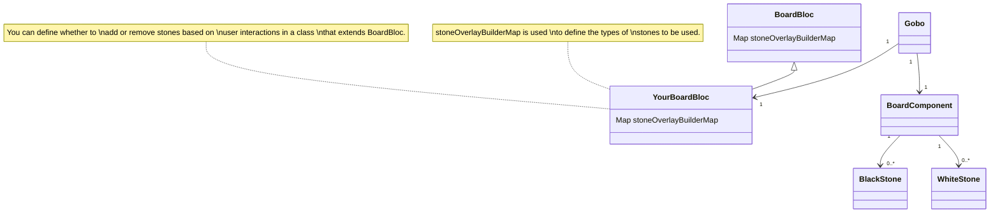

# Gobo

## Architecture

### Simplified Architecture

```mermaid
classDiagram
    class BoardBloc {
        Map stoneOverlayBuilderMap
    }

    class YourBoardBloc {
        Map stoneOverlayBuilderMap
    }

    Gobo "1" --> "1" YourBoardBloc
    Gobo "1" --> "1" BoardComponent
    BoardBloc <|-- YourBoardBloc
    BoardComponent "1" --> "0..*" BlackStone
    BoardComponent "1" --> "0..*" WhiteStone

    note for YourBoardBloc "You can define whether to \nadd or remove stones based on \nuser interactions in a class \nthat extends BoardBloc."

    note for YourBoardBloc "stoneOverlayBuilderMap is used \nto define the types of \nstones to be used."
```
