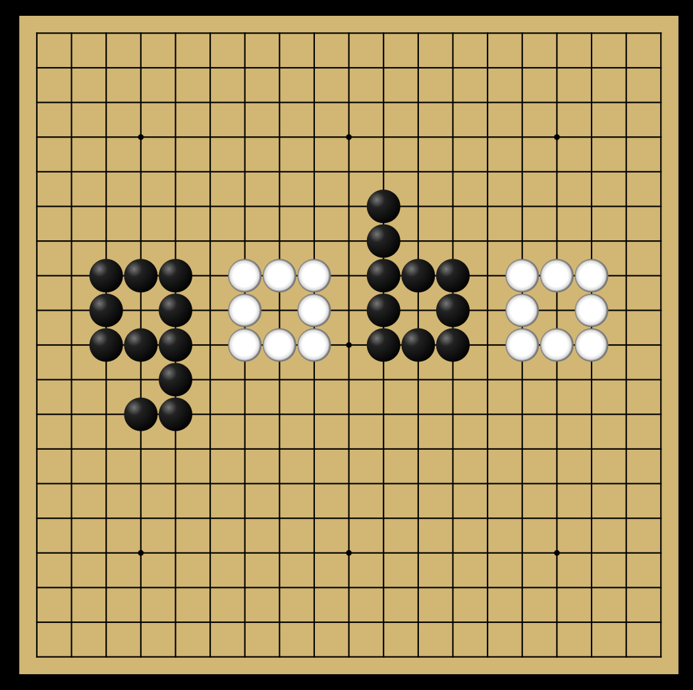

<!-- markdownlint-disable MD013 -->
<p align="center">
    
</p>

<p align="center">
  <a title="Pub" href="https://pub.dev/packages/gobo"></a>
  <a title="CICD" href="https://pub.dev/packages/flutter_gobo"></a>
  <a title="License: MIT" href="https://opensource.org/licenses/MIT"></a>
</p>

<p align="center">
  ⭐ Star us on GitHub — it motivates us a lot!
</p>

# gobo

Want to see it in action? Check out the [interactive demo](https://reirev.github.io/flutter_gobo/) powered by Widgetbook! You can find the Widgetbook implementation code [here](https://github.com/ReiRev/flutter_gobo/tree/main/widgetbook).

Gobo is a straightforward Flutter package designed for creating Go boards. It leverages [Flame](https://github.com/flame-engine/flame) game engine, for efficient rendering.

Please note that Go rules and game logic are not included in Gobo. For those looking for a Dart-based Go rules engine, consider using our another package, [golo](https://github.com/ReiRev/dart_golo).



## Installation

```bash
flutter pub add gobo
```

## Note

This package is still in active development. We welcome any feedback or suggestions to help us improve Gobo. Feel free to open an issue to discuss.
